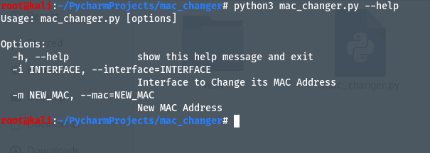
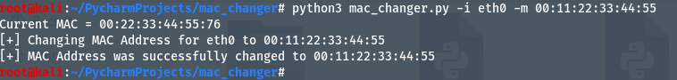
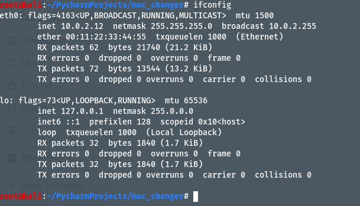

# MAC Address Changer Using Python

## Steps to run:
1. Clone or Download the repository.
2. Run the macChanger.py file using `python3 macChanger.py --help` 
3. This will show how to use the program 

4. For example, if you want to change the interface eth0 MAC Address to 00:11:22:33:44:55, use the command   `python3 macChanger.py -i eth0 -m 00:11:22:33:44:55`   

5. This will change the MAC Address, verify it using `ifconfig` command.   

